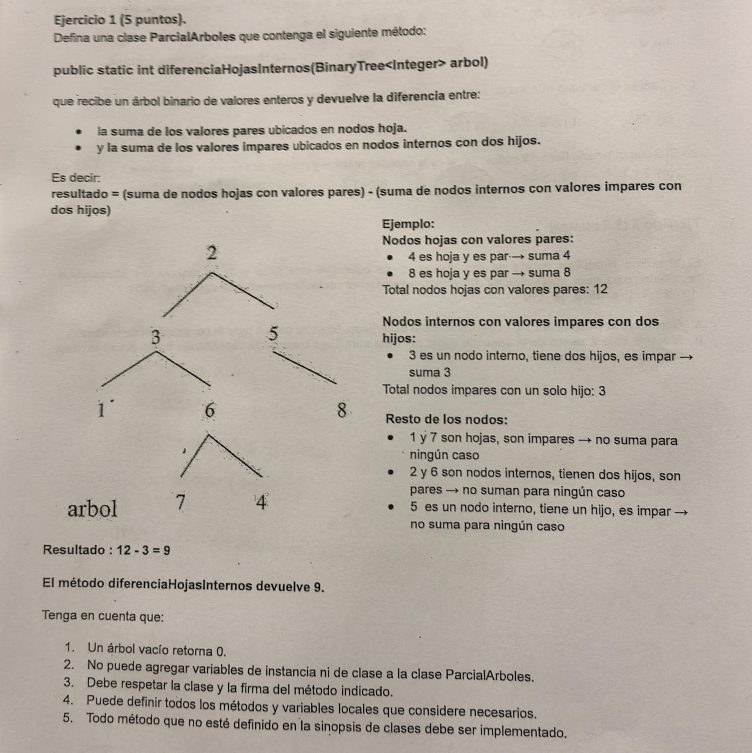

# Parcial: Diferencia entre Hojas Pares e Internos Impares 🌳🔢

Este ejercicio corresponde al examen de **Algoritmos y Estructuras de Datos** del 9 de mayo de 2025. El objetivo es procesar un árbol binario y calcular un valor específico basado en la paridad de los datos y la posición de los nodos.

## 📝 Consigna
Definir una clase `ParcialArboles` con el método:
`public static int diferenciaHojasInternos(BinaryTree<Integer> arbol)`

El método debe devolver la **diferencia** entre:
1.  La suma de los valores **pares** ubicados en **nodos hoja**.
2.  La suma de los valores **impares** ubicados en **nodos internos con dos hijos**.

### Ejemplo de la imagen:
* **Hojas pares:** 4 + 8 = **12**
* **Internos impares (2 hijos):** Solo el nodo 3 = **3**
* **Resultado:** 12 - 3 = **9**



---

## 🛠️ Tecnologías y Conceptos
* **Lenguaje:** Java
* **Estructura de Datos:** BinaryTree (Árbol Binario)
* **Algoritmo:** Recorrido en profundidad (DFS) con un único retorno.

## 💡 Lógica de Resolución
Para resolverlo de manera eficiente en un solo recorrido, se utiliza un método `helper` recursivo que acumula los valores según las condiciones:

1.  **Condición Hoja Par:** Si `isLeaf()` y el dato es divisible por 2, el valor **suma** al total.
2.  **Condición Interno Doble Impar:** Si el dato es impar y tiene ambos hijos (`hasLeftChild() && hasRightChild()`), el valor **resta** al total.
3.  **Recursión:** Se suman los resultados de los subárboles izquierdo y derecho para consolidar el valor final en la raíz.

---

## 📁 Estructura del Código
El método se implementó de forma estática respetando las restricciones de no utilizar variables de instancia:

```java
public static int diferenciaHojasInternos(BinaryTree<Integer> arbol)