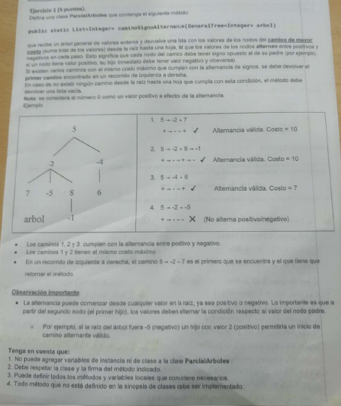

# Parcial: Árboles Generales - Camino de Signo Alternante ➕➖

Otro ejercicio clásico de la cátedra de **Algoritmos y Estructuras de Datos**. En este caso, el foco está en el procesamiento de valores numéricos y la acumulación de costos en un recorrido de tipo Backtracking.

## 📝 Consigna
Implementar un método que reciba un árbol general de enteros y devuelva una lista con los valores de los nodos del **camino de mayor costo** (suma total de los valores) desde la raíz hasta una hoja, cumpliendo con la **alternancia de signos**.

### Reglas:
1. El camino debe ser desde la raíz hasta una hoja.
2. Cada nodo debe tener signo opuesto al de su padre (el número 0 se considera positivo).
3. Si existen varios caminos con el mismo costo máximo, se debe devolver el primero encontrado (izquierda a derecha).
4. Si no hay caminos válidos, retornar una lista vacía.



---

## 🛠️ Tecnologías utilizadas
* **Lenguaje:** Java
* **Estructura de Datos:** GeneralTree (Árbol General)
* **Técnica:** Backtracking con acumulador de costo.

## 💡 Lógica de Resolución
A diferencia del ejercicio de paridad, aquí no buscamos el camino más largo en nodos, sino el que sume más:

1. **Control de Signos:** Se utiliza la lógica `(anterior >= 0 && act < 0 || anterior < 0 && act >= 0)` para validar la alternancia en cada paso de la recursión.
2. **Acumulación de Costo:** Se pasa un entero `costoActual` en la firma del método `helper` para llevar la cuenta de la suma sin necesidad de recorrer la lista `actual` constantemente.
3. **Comparación:** Al llegar a una hoja, se compara el `costoActual` contra la suma del mejor camino guardado hasta el momento mediante un método auxiliar `sumarCosto`.

---

## 📁 Estructura del Código
El código respeta la firma solicitada y utiliza recursión para explorar todas las variantes posibles:
```java
public static List<Integer> caminoSignoAlternante(GeneralTree<Integer> arbol)