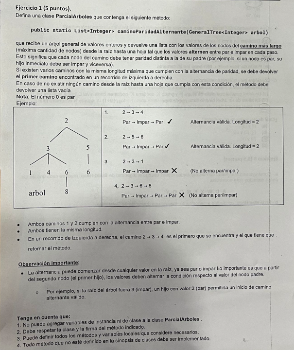

# Parcial: Árboles Generales - Camino Paridad Alternante 🌳

Este ejercicio corresponde a un parcial de la materia **Algoritmos y Estructuras de Datos**. El objetivo es trabajar con estructuras de datos no lineales (Árboles Generales) y aplicar algoritmos de recorrido para encontrar caminos específicos.

## 📝 Consigna
Se solicita implementar un método que reciba un árbol general de enteros y devuelva el **camino más largo** desde la raíz hasta una hoja, tal que los valores de los nodos **alternen entre par e impar** en cada paso.

### Reglas:
1. El camino debe ser desde la raíz hasta una hoja.
2. Cada nodo debe tener paridad distinta a la de su padre.
3. Si hay varios caminos de igual longitud máxima, se debe devolver el primero encontrado (recorrido de izquierda a derecha).
4. Si no existe tal camino, devolver una lista vacía.



---

## 🛠️ Tecnologías utilizadas
* **Lenguaje:** Java
* **Estructura de Datos:** GeneralTree (Árbol General)
* **Algoritmo:** Backtracking (Recursión)

## 💡 Lógica de Resolución
La solución implementada utiliza una técnica de **Backtracking** para explorar el árbol:

1. **Condición de entrada:** Para cada nodo, verificamos si su paridad es distinta a la del último nodo agregado al camino actual (`actual.get(actual.size()-1)`).
2. **Registro de camino máximo:** Si llegamos a una hoja y el camino actual es más largo que el `caminoMaximo` guardado, actualizamos este último.
3. **Paso de limpieza (Backtracking):** Al finalizar la exploración de los hijos de un nodo, removemos el nodo del camino actual (`actual.remove(actual.size()-1)`) para permitir que otras ramas sean exploradas correctamente.

---

## 📁 Estructura del Código
El código se encuentra en el paquete `ParcialesArboles` y respeta la firma solicitada:
```java
public static List<Integer> caminoParidadAlternante(GeneralTree<Integer> arbol)