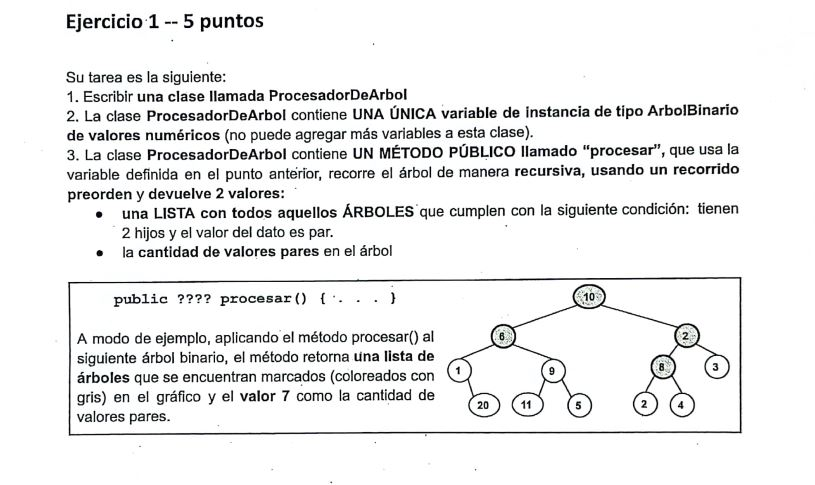

# Parcial: Árboles Binarios - Procesador de Árbol 🌳

Este ejercicio corresponde a un parcial de **Algoritmos y Estructuras de Datos**. Se enfoca en el recorrido de árboles binarios y la gestión de múltiples valores de retorno mediante un objeto contenedor.

## 📝 Consigna
Escribir una clase `ProcesadorDeArbol` que contenga una única variable de instancia de tipo `ArbolBinario`. Se debe implementar un método **público** llamado `procesar` que realice un recorrido **preorden** y devuelva:
1. Una **lista** con todos los subárboles que cumplen: tienen 2 hijos y su dato es par.
2. La **cantidad** total de valores pares presentes en todo el árbol.



---

## 🛠️ Tecnologías utilizadas
* **Lenguaje:** Java
* **Estructura de Datos:** BinaryTree (Árbol Binario)
* **Algoritmo:** Recorrido Preorden (Recursivo)

## 💡 Lógica de Resolución
Para cumplir con la restricción de devolver dos valores distintos, se implementó una clase auxiliar llamada `Recurso`.

1. **Recorrido Preorden:** El algoritmo procesa primero el nodo actual (raíz) y luego invoca la recursión para el hijo izquierdo y el derecho.
2. **Objeto Contenedor:** La clase `Recurso` encapsula tanto la `List<BinaryTree<Integer>>` como el `int contador`, permitiendo que el método principal retorne ambos datos de forma cohesiva.
3. **Condiciones de filtrado:**
   - Para el contador: `dato % 2 == 0`.
   - Para la lista: `hasLeftChild() && hasRightChild()`.

---

## 📁 Estructura del Proyecto
El código se divide en dos clases principales dentro del paquete `ParcialesArboles`:

* **`ProcesadorArboles.java`**: Contiene la lógica del recorrido y el procesamiento.
* **`Recurso.java`**: Clase POJO (Plain Old Java Object) utilizada para transportar los resultados.

```java
public Recurso procesar(BinaryTree<Integer> arbol)
