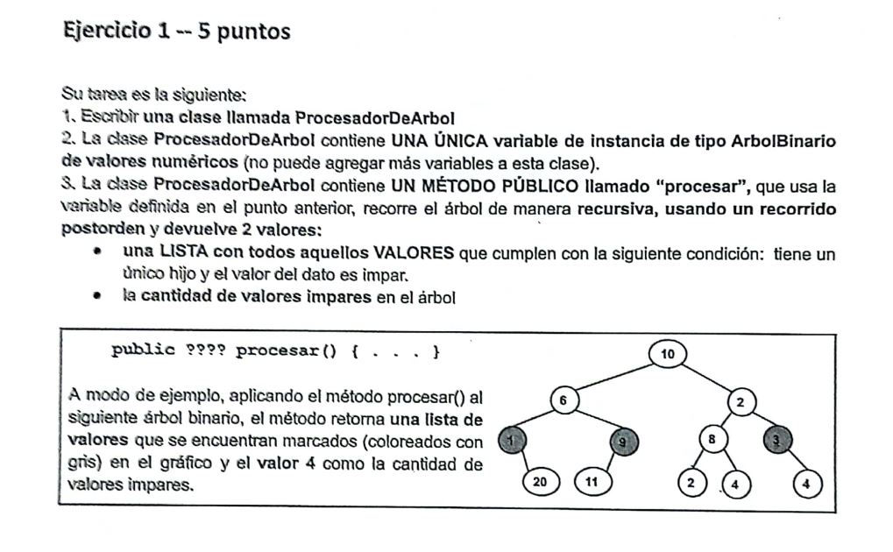

# Parcial: Árboles Binarios - Procesador de Árbol (Tema 2) 🌳

Este ejercicio corresponde a una variante de parcial de **Algoritmos y Estructuras de Datos**. Se centra en el recorrido de árboles binarios y la recolección de datos específicos basados en su paridad.

## 📝 Consigna
Implementar la clase `ProcesadorArbol` que reciba un árbol binario de enteros y devuelva un objeto `Recurso` que contenga:
1. Una **lista** con los valores de todos los nodos del árbol que son **impares**.
2. La **cantidad** total de nodos que poseen **un único hijo** (izquierdo o derecho).



---

## 🛠️ Tecnologías utilizadas
* **Lenguaje:** Java
* **Estructura de Datos:** BinaryTree (Árbol Binario)
* **Algoritmo:** Recorrido Postorden 

## 💡 Lógica de Resolución
Nuevamente se utiliza una clase auxiliar llamada `Recurso` para poder retornar dos tipos de datos distintos en un solo método.

1. **Conteo de Hijos Únicos:** En el método `helperProcesar`, se verifica si un nodo tiene exactamente un hijo para incrementar el contador. Esto se detecta evaluando:
   - `hasLeftChild()` XOR `hasRightChild()` (o verificando si uno existe y el otro no).
2. **Filtrado de Impares:** Se evalúa si `dato % 2 != 0` para agregar el valor a la lista de resultados.
3. **Estructura del Código:**
   - **`ProcesadorArbol.java`**: Realiza la lógica de recorrido.
   - **`Recurso.java`**: Almacena la `List<Integer>` y el `int cantidadImpares`.

---

## 📁 Estructura del Proyecto
El código se encuentra organizado de la siguiente manera:

```java
public Recurso procesar(BinaryTree<Integer> arbol)