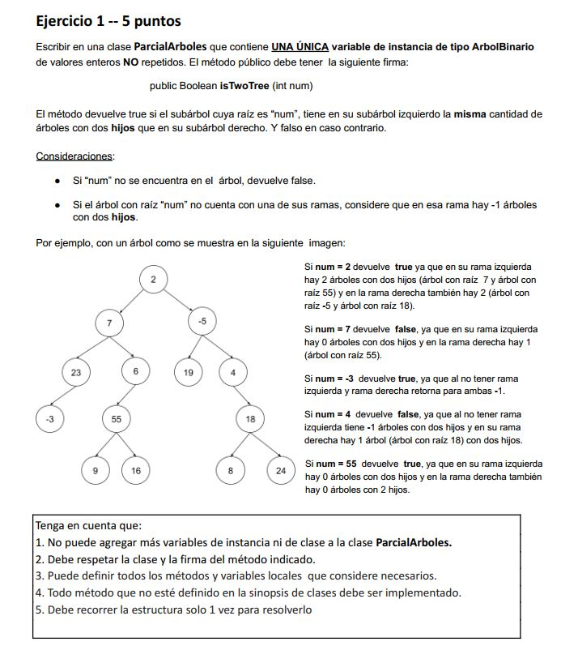

# Parcial: Árboles Binarios - isTwoTree 🌳

Este ejercicio corresponde a un parcial de **Algoritmos y Estructuras de Datos** (6 de Mayo de 2023). Se centra en la búsqueda de nodos específicos y el análisis comparativo de sus subárboles.

## 📝 Consigna
Implementar un método `isTwoTree(int num)` que busque el nodo con el valor `num` dentro de un árbol binario de enteros no repetidos. El método debe devolver `true` si:
1. El subárbol cuya raíz es `num` tiene en su **rama izquierda** la misma cantidad de "árboles con dos hijos" que en su **rama derecha**.
2. Si una rama no existe, se debe considerar que contiene **-1** árboles con dos hijos.



---

## 🛠️ Tecnologías utilizadas
* **Lenguaje:** Java
* **Estructura de Datos:** BinaryTree (Árbol Binario)
* **Algoritmos:** Búsqueda recursiva y Conteo Postorden

## 💡 Lógica de Resolución
La solución se divide en tres etapas clave para mantener la claridad y responsabilidad del código:

1. **Búsqueda (`buscar`):** Un método recursivo que localiza el nodo `num` en la estructura. Si no lo encuentra, el flujo principal retorna `false`.
2. **Conteo de "Nodos Dobles" (`contar`):** Una vez hallado el nodo, se exploran sus ramas. Se utiliza una lógica de acumulación donde un nodo suma `1` solo si tiene ambos hijos (`hasLeftChild() && hasRightChild()`).
3. **Manejo de Casos Especiales:** Se inicializan los contadores de ramas en `-1`. Solo si la rama existe, se procede a contar sus nodos dobles, cumpliendo con la restricción de la consigna para hojas o nodos con un solo hijo.

---

## 📁 Estructura del Código
La clase `ParcialArboles5` contiene la variable de instancia `arbol` y los métodos privados de soporte:

```java
public boolean isTwoTree(int num)