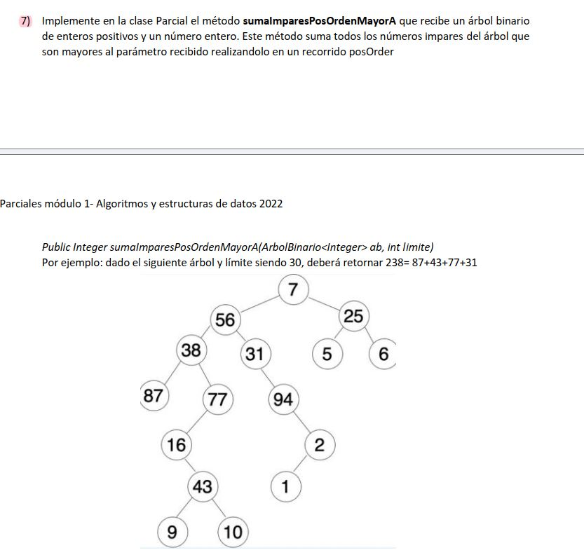

# Parcial: Árboles Binarios - Suma Impares Postorden ➕🌳

Este ejercicio corresponde a un parcial del **Módulo 1 de Algoritmos y Estructuras de Datos (2022)**. El desafío principal consiste en realizar un recorrido específico procesando los datos bajo múltiples condiciones.

## 📝 Consigna
Implementar el método `sumaImparesPostOrdenMayorA` que recibe un árbol binario de enteros y un número entero (`limite`). El método debe retornar la suma de todos los números **impares** del árbol que sean **mayores al parámetro recibido**, realizando obligatoriamente un recorrido **Postorden**.

### Ejemplo del Enunciado:
Con un límite de **30**, el resultado esperado es **238**, proveniente de la suma de:
* 87 + 77 + 43 + 31 = 238.



---

## 🛠️ Tecnologías y Conceptos
* **Lenguaje:** Java
* **Recorrido:** Postorden (Hijo Izq -> Hijo Der -> Raíz)
* **Técnica:** Recursión con acumulador

## 💡 Análisis de la Solución
El recorrido **Postorden** es fundamental aquí:
1. Se explora recursivamente el subárbol izquierdo.
2. Se explora recursivamente el subárbol derecho.
3. Finalmente, se evalúa el nodo actual (raíz).
   - Condición: `(dato % 2 != 0 && dato > limite)`.

Este enfoque asegura que procesamos las hojas y subárboles antes de decidir sobre la raíz, optimizando la acumulación de la suma en la pila de recursión.

---

## 📁 Estructura del Código
El método se encuentra en la clase `Parcial` y sigue la firma solicitada:
```java
public int sumaImparesPostOrdenMayorA(BinaryTree<Integer> arbol, int limite)