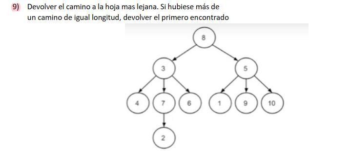

# Parcial: Árboles Generales - Camino a la Hoja más Lejana 🌳🛤️

Este ejercicio corresponde a un parcial de **Algoritmos y Estructuras de Datos**. El objetivo es encontrar el camino más largo (con mayor cantidad de nodos) que comience en la raíz y termine en una hoja.

## 📝 Consigna
Implementar en la clase `ParcialArboles` el método `caminoMasLargo(GeneralTree<Integer> arbol)` que devuelva una lista con los datos de los nodos del camino más largo desde la raíz hasta una hoja.

---

## 🛠️ Tecnologías y Conceptos
* **Lenguaje:** Java
* **Estructura de Datos:** GeneralTree (Árbol General)
* **Algoritmo:** Backtracking (Búsqueda con retroceso)

## 💡 Lógica de Resolución
Para resolver este problema de forma eficiente, se utiliza una estrategia de **recorrido en profundidad (DFS)** combinada con **Backtracking**:

1. **Estado Actual:** Se mantiene una lista `actual` que guarda el camino que se está explorando en el momento.
2. **Caso Base (Hoja):** Cuando el algoritmo llega a un nodo hoja (`isLeaf`), compara el tamaño de la lista `actual` con la lista `lista` (que guarda el mejor camino encontrado hasta el momento). Si el actual es más largo, se actualiza el mejor camino.
3. **Exploración:** Si el nodo no es hoja, se invoca la recursión para cada uno de sus hijos.
4. **Retroceso (Backtracking):** Al terminar de explorar todos los descendientes de un nodo, este se elimina de la lista `actual` (`remove(size-1)`). Esto permite "limpiar" el camino para que, al volver al padre, se puedan probar otras ramas sin ensuciar los datos.

---

## 📁 Estructura del Proyecto
El código se organiza en la clase