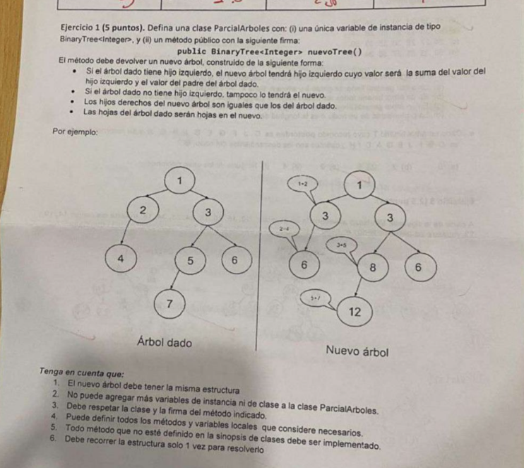

# Parcial: Árboles Binarios - Generación de Nuevo Árbol Sumado 🌳➕

Este ejercicio consiste en crear una copia de un árbol binario original aplicando transformaciones específicas en los valores de sus nodos según su posición en la jerarquía.

## 📝 Consigna
Definir una clase `ParcialArboles` con un método `nuevoTree()` que devuelva un nuevo árbol construido bajo las siguientes reglas:

1. **Hijo Izquierdo:** El valor del nuevo nodo izquierdo será la suma del valor del nodo hijo original más el valor de su padre original.
2. **Hijo Derecho:** El valor del nuevo nodo derecho será igual al valor del nodo original (sin cambios).
3. **Estructura:** El nuevo árbol debe mantener exactamente la misma estructura que el original.
4. **Hojas:** Las hojas del árbol original deben seguir siendo hojas en el nuevo.



---

## 🛠️ Tecnologías y Conceptos
* **Lenguaje:** Java
* **Estructura de Datos:** BinaryTree (Árbol Binario)
* **Algoritmo:** Recorrido Preorden (Raíz -> Izquierda -> Derecha)

## 💡 Lógica de Resolución
Para cumplir con la restricción de recorrer la estructura **una sola vez**, se utiliza un método helper recursivo que arrastra el valor del "padre" como un parámetro adicional:

1. **Parámetro `num`:** Se utiliza para pasar el valor del padre hacia el hijo izquierdo. Para los hijos derechos, este parámetro se pasa como `0` para no alterar su valor original.
2. **Instanciación:** En cada paso de la recursión, se crea un nuevo objeto `BinaryTree<Integer>`, asegurando que el nuevo árbol sea una estructura independiente de la original.
3. **Asignación de datos:** `nuevoNodo.setData(original.getData() + num)`.

---

## 📁 Estructura del Código
El método se encuentra en la clase `ParcialArboles4` y respeta la firma solicitada:

```java
public BinaryTree<Integer> nuevoTree()